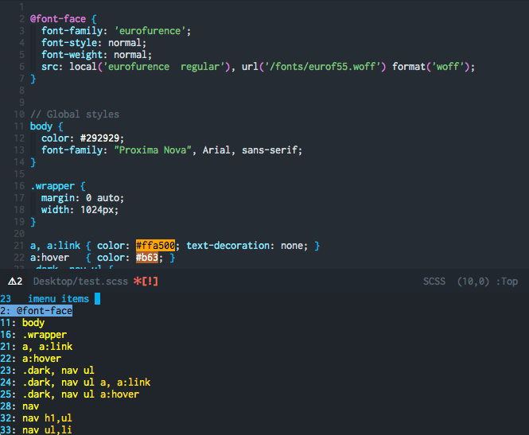

[](./LICENSE)

# counsel-css

`counsel-css` is an ivy-mode backend for css selectors (works for SCSS and LESS
too). It also has a hook to integrate its parser into Imenu.

This is an alternative to [helm-css-scss]. The parser was ~~lifted~~
**borrowed** from [helm-css-scss], so much of the credit is his.



## Installation

```emacs-lisp
(require 'counsel-css)
```

## Usage

This plugin doesn't bind keys, but it defines the command `counsel-css`.

## CSS/SCSS + IMenu integration

To activate imenu integration:

`(add-hook 'css-mode-hook 'counsel-css-imenu-setup)`

NOTE: If you only want imenu support, this plugin doesn't pull in its
dependencies until you use the `counsel-css` command.


[helm-css-scss]: https://github.com/ShingoFukuyama/helm-css-scss
